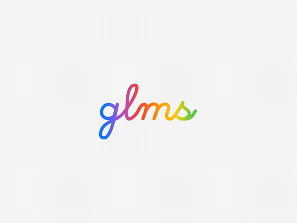

<div align="center">




### Genelec GLM Monitor for macOS

A lightweight macOS menu bar app that provides real-time volume monitoring for Genelec SAM monitors via the GLM software.

Built with SwiftUI and macOS 26 Tahoe's Liquid Glass design.

**[English](#english)** · **[简体中文](#简体中文)** · **[繁體中文](#繁體中文)** · **[日本語](#日本語)** · **[한국어](#한국어)** · **[Deutsch](#deutsch)** · **[Français](#français)** · **[Español](#español)**

</div>

---

## English

### Features

- **Real-time Volume Display** — Live volume readout in the menu bar and popup panel
- **Volume Change HUD** — Floating Liquid Glass overlay appears on volume changes, works over fullscreen apps
- **Mute Control** — Toggle mute directly from the menu bar
- **GLM Auto-Launch** — Automatically launches GLM on startup and runs it in the background
- **Hide/Show GLM** — Hide GLM's window without quitting it — no Dock icon clutter
- **Dynamic Volume Limits** — Reads max volume from your GLM calibration setup
- **Multi-Language** — 11 languages: English, 简体中文, 繁體中文, 日本語, 한국어, Deutsch, Français, Español, Português, Русский
- **Configurable Polling** — Standard / Fast / Fastest polling speed

### Requirements

- macOS 26 (Tahoe) or later
- Xcode 26 or later
- [Genelec GLM](https://www.genelec.com/glm) software installed
- Accessibility permission granted (System Settings → Privacy & Security → Accessibility)

### Installation

```bash
git clone https://github.com/Leah16/GLMS.git
cd GLMS
swift build -c release
```

Run directly:
```bash
swift run
```

Or open in Xcode:
```bash
open Package.swift
```

### How It Works

GLMS reads volume data from the GLM application using the macOS Accessibility API (`AXUIElement`). It does not communicate directly with Genelec hardware — GLM handles all hardware communication while GLMS observes and displays the state.

### Architecture

```
GLMMonitorApp          → SwiftUI App entry, MenuBarExtra
├── VolumeService      → Polls GLM via Accessibility API, manages state
├── MenuBarView        → Popup panel with volume, mute, settings
├── VolumeHUDPanel     → Floating NSPanel for volume change overlay
├── VolumeHUDView      → Liquid Glass HUD content
├── SettingsView       → Preferences (polling speed, language, etc.)
└── Localization       → Multi-language string management
```

---

## 简体中文

### 功能特性

- **实时音量显示** — 菜单栏和弹出面板实时显示当前音量
- **音量变化浮窗** — 调节音量时右上角弹出 Liquid Glass 风格浮窗，支持全屏应用
- **静音控制** — 直接在菜单栏切换静音
- **自动启动 GLM** — 启动时自动运行 GLM 并隐藏到后台
- **隐藏/显示 GLM** — 隐藏 GLM 窗口而不退出，不占用 Dock 栏
- **动态音量上限** — 从 GLM 校准配置中读取最大音量限制
- **多语言支持** — 支持 11 种语言
- **可调轮询速度** — 标准 / 快速 / 最快

### 系统要求

- macOS 26 (Tahoe) 或更高版本
- Xcode 26 或更高版本
- 已安装 [Genelec GLM](https://www.genelec.com/glm) 软件
- 已授予辅助功能权限（系统设置 → 隐私与安全性 → 辅助功能）

### 安装

```bash
git clone https://github.com/Leah16/GLMS.git
cd GLMS
swift build -c release
swift run
```

### 工作原理

GLMS 通过 macOS 辅助功能 API（`AXUIElement`）读取 GLM 应用的界面数据，不直接与真力硬件通信。GLM 负责所有硬件通信，GLMS 仅监控和展示状态。

---

## 繁體中文

### 功能特色

- **即時音量顯示** — 選單列和彈出面板即時顯示目前音量
- **音量變化浮窗** — 調節音量時右上角彈出 Liquid Glass 風格浮窗
- **靜音控制** — 直接在選單列切換靜音
- **自動啟動 GLM** — 啟動時自動執行 GLM 並隱藏至背景
- **隱藏/顯示 GLM** — 隱藏 GLM 視窗而不結束程式
- **動態音量上限** — 從 GLM 校準設定讀取最大音量限制
- **多語言支援** — 支援 11 種語言
- **可調輪詢速度** — 標準 / 快速 / 最快

### 系統需求

- macOS 26 (Tahoe) 或更新版本
- Xcode 26 或更新版本
- 已安裝 [Genelec GLM](https://www.genelec.com/glm) 軟體
- 已授予輔助使用權限（系統設定 → 隱私權與安全性 → 輔助使用）

---

## 日本語

### 機能

- **リアルタイム音量表示** — メニューバーとポップアップパネルで音量をリアルタイム表示
- **音量変更HUD** — 音量変更時にLiquid Glassスタイルのフローティングオーバーレイを表示
- **ミュートコントロール** — メニューバーから直接ミュート切り替え
- **GLM自動起動** — 起動時にGLMを自動的にバックグラウンドで起動
- **GLMの表示/非表示** — GLMウィンドウを終了せずに非表示
- **動的音量制限** — GLMキャリブレーション設定から最大音量を読み取り
- **多言語対応** — 11言語に対応
- **ポーリング速度設定** — 標準 / 高速 / 最速

### システム要件

- macOS 26 (Tahoe) 以降
- Xcode 26 以降
- [Genelec GLM](https://www.genelec.com/glm) がインストール済み
- アクセシビリティ権限の付与が必要

---

## 한국어

### 기능

- **실시간 볼륨 표시** — 메뉴 바와 팝업 패널에서 실시간 볼륨 표시
- **볼륨 변경 HUD** — 볼륨 변경 시 Liquid Glass 스타일의 플로팅 오버레이 표시
- **음소거 제어** — 메뉴 바에서 직접 음소거 전환
- **GLM 자동 실행** — 시작 시 GLM을 자동으로 백그라운드에서 실행
- **GLM 표시/숨기기** — GLM 창을 종료하지 않고 숨기기
- **동적 볼륨 제한** — GLM 캘리브레이션 설정에서 최대 볼륨 읽기
- **다국어 지원** — 11개 언어 지원
- **폴링 속도 설정** — 표준 / 빠름 / 가장 빠름

### 시스템 요구 사항

- macOS 26 (Tahoe) 이상
- Xcode 26 이상
- [Genelec GLM](https://www.genelec.com/glm) 설치 필요
- 손쉬운 사용 권한 필요

---

## Deutsch

### Funktionen

- **Echtzeit-Lautstärkeanzeige** — Live-Lautstärke in der Menüleiste und im Popup-Panel
- **Lautstärkeänderungs-HUD** — Schwebendes Liquid-Glass-Overlay bei Lautstärkeänderungen
- **Stummschaltung** — Stummschaltung direkt über die Menüleiste umschalten
- **GLM Auto-Start** — Startet GLM automatisch beim Start und führt es im Hintergrund aus
- **GLM Ein-/Ausblenden** — GLM-Fenster ausblenden, ohne die App zu beenden
- **Dynamische Lautstärkegrenzen** — Liest die maximale Lautstärke aus Ihrer GLM-Kalibrierung
- **Mehrsprachig** — 11 Sprachen unterstützt
- **Einstellbare Abfragegeschwindigkeit** — Standard / Schnell / Schnellste

### Systemvoraussetzungen

- macOS 26 (Tahoe) oder neuer
- Xcode 26 oder neuer
- [Genelec GLM](https://www.genelec.com/glm) installiert
- Bedienungshilfen-Berechtigung erforderlich

---

## Français

### Fonctionnalités

- **Affichage du volume en temps réel** — Volume en direct dans la barre de menus et le panneau contextuel
- **HUD de changement de volume** — Overlay Liquid Glass flottant lors des changements de volume
- **Contrôle de la sourdine** — Basculer la sourdine directement depuis la barre de menus
- **Lancement automatique de GLM** — Lance GLM automatiquement au démarrage en arrière-plan
- **Masquer/Afficher GLM** — Masquer la fenêtre GLM sans quitter l'application
- **Limites de volume dynamiques** — Lit le volume maximum depuis votre calibration GLM
- **Multilingue** — 11 langues supportées
- **Vitesse de scrutation configurable** — Standard / Rapide / Le plus rapide

### Configuration requise

- macOS 26 (Tahoe) ou ultérieur
- Xcode 26 ou ultérieur
- [Genelec GLM](https://www.genelec.com/glm) installé
- Permission d'accessibilité requise

---

## Español

### Características

- **Visualización de volumen en tiempo real** — Volumen en vivo en la barra de menús y panel emergente
- **HUD de cambio de volumen** — Overlay flotante Liquid Glass al cambiar el volumen
- **Control de silencio** — Activar/desactivar silencio directamente desde la barra de menús
- **Inicio automático de GLM** — Inicia GLM automáticamente en segundo plano
- **Ocultar/Mostrar GLM** — Ocultar la ventana de GLM sin cerrar la aplicación
- **Límites de volumen dinámicos** — Lee el volumen máximo desde la calibración GLM
- **Multilingüe** — 11 idiomas soportados
- **Velocidad de sondeo configurable** — Estándar / Rápido / Más rápido

### Requisitos del sistema

- macOS 26 (Tahoe) o posterior
- Xcode 26 o posterior
- [Genelec GLM](https://www.genelec.com/glm) instalado
- Permiso de accesibilidad requerido

---

<div align="center">

### License

[GNU General Public License v3.0](LICENSE)

</div>
